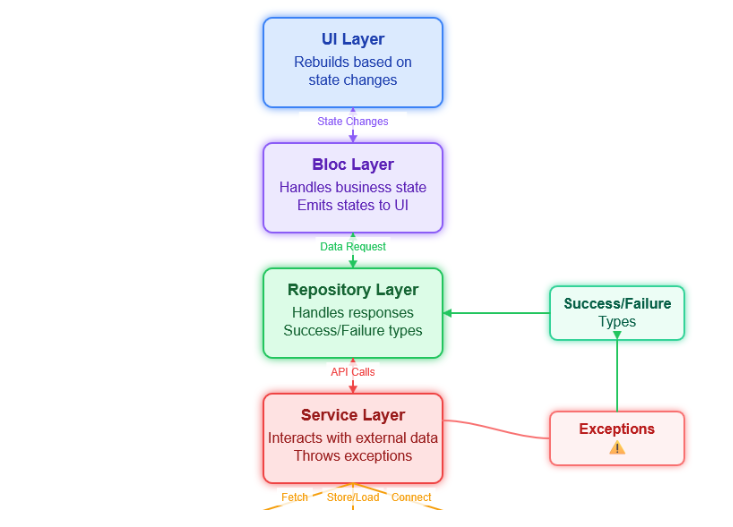

## Design Guide
- naming files should be clear and descriptive if it needed to relativly long name use `snake_case`
- naming classes should be clear and descriptive if it needed to relativly long name use `PascalCase`
- naming `variables` & `functions` should be clear and descriptive if it needed to relativly long name use `camelCase`
- prefer **relative** import for internal and local files imports while **package** imports import for external libaraies and packages
    ```dart
    // internal and local files imports
    ❌ import 'package:wellness/features/user_questionnaire/data/exercise_type_model.dart';
    ✅ import '../data/exercise_type_model.dart'; //Do this 

    //external libaraies and package imports
    ✅ import 'package:package_name/package_name.dart';
    ✅ import 'package:package_name/sub_package/sub_package.dart';
    ```
- 


### Features
  - A Feature is 
  - every feature must have a clear `feature_name` folder and live inside `lib/features` folder
  

  

### State & State Management
the states is split into 2 parts:
  - **`UI State`** which refers to the state of purely UI visuals and not related to the business logic like changing `color`, `size`, `padding`, `margin`, etc.
  - **`Business State`** which refers to the state of the business logic and not related to the UI visuals like interacting with **API**, **Database**, **Local Storage**, **Shared Preferences**, **Firebase**, etc.


#### UI State
  - UI State is handled by ViewModel that uses `ValueNotifier` to notify the UI to rebuild

#### Business State
  
 - Business State is handled by `Bloc` to notify the UI to rebuild for the new state or data  
 - **`Bloc`** exposed only to the **`Repositories`** which intern relies on the **`Services`** to interact with the `API` or `Local Storage` or `Firebase` etc.
 - **`Services`** is the layer that interacts with the real world data `APIs`, `DataBases`, etc.
 - **Services** throws `Exceptions` to the  next layer (Repositories) which then turn into **Success** or **Failure** Types and then into the correct states to be emitted to the UI. 
 - **`Repositories`** is the layer that interacts with the **`Services`** with proper handling of the **Exceptions** of **Success** or **Failure** Types.


### Models
  - always append `_model` for file name, like this  `{model_name}_model.dart`
  - created models must implement `toString` method with short & clear description of model 
  - models **may** but not required to implement `copyWith` `toJson` and `fromJson` method


### Folder Structure

The lib folder contains the Flutter application.
```
lib
└─── 📂core
└─── 📂features
└─── main.dart
```

core folder contains the core files of the application, like `utils`, `routing`, `models`, `services`, `widgets`, `components`, etc.
```
lib
├─┬─ 📂 core
│ ├─┬─ 📂 common
│ │ │ └─── 📂 <shared widgets>
│ │ │ └─── 📂 <shared services>
│ │ │ └─── 📂 <shared models>
│ ├─── 📂 utils
| ├─── 📂 routing
| ├─── 📂 routing
```

features folder contains the features of the application, like `user_questionnaire`, `user_profile`, `user_settings`, etc.
```
lib
├─┬─ 📂 features
│ └─── 📂 feature_name_1
│ └─── 📂 feature_name_2
│ └─── 📂 feature_name_2
├─── main_staging.dart [Optional]
├─── main_development.dart [Optional]
└─── main.dart
```

feature_name_1 folder contains the presentation, data, and business logic of the feature, like `presentation`, `data`, `business_logic`, etc.
```
📂 feature_name_1
├─┬─ 📂 <presentation>
│ │ └─── 📂 <components>
│ │ └─── 📂 <widgets>
│ │ └─── {screenName}_screen.dart
│ └─── 📂 <data>
│ │ └─── 📂 <service>
│ │ |  └─── <service class>.dart
│ │ └─── 📂 <repository>
│ │ |  └─── <repository class>.dart
│ │ └─── 📂 <models>
└────────── <api model class>.dart
```